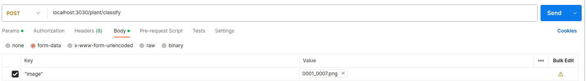

# IoPlants

Project of IoT for monitoring Plants


# Organization

```
├── code
│   ├── backend_img #python backend for disease classification
│   └── simulate    #python script to simulate the hardware
```


# Simulator

To run the simulator it is necessary to first create a account on [KonkerLab](), create a device and configure the **device username and password** inside the [simulate.py](code/simulate/simulate.py) file

then run the simulate code which will simuate a normal, high or low measures of temperature, humidity and soil humidity. The script will simulate 100 measurements.

for a normal operation use:

```
python code/simulate/simulate.py 0 0 0 0
```

the value '1' will simulate a increase in measuments, for example a increase in temperature and humidity:

```
python code/simulate/simulate.py 1 1 0 0
```

and 2 for low simulation, for example a simulation fo low soil humidity and luminosity

```
python code/simulate/simulate.py 0 0 2 2
```


# Disease detection


The [backend](code/backend_img) is a service for plant disease diagnosis, where one can run with

```
python code/backend_image/server.py
```

and query the diagnosis by using a POST method as shown:



the system will return the image class number and name:


```
{
    "pred_v": "1",
    "pred_c": "cerco"
}
```


TODO: implement the gradCAM method, which will also classify the plant disease but also return the heatmap image.